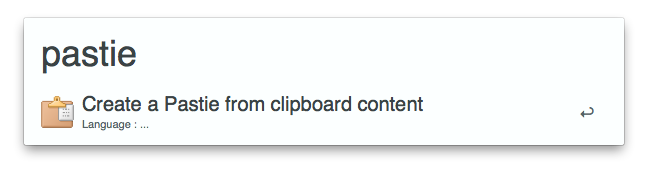
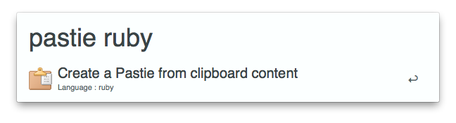

Pastie Workflow
======================

Alfred 2 Workflow to create [Pasties](http://pastie.org).

Installation
------------

Just download and open [Pastie.alfredworkflow](https://github.com/fklingler/alfred-pastie/raw/master/Pastie.alfredworkflow)!

Usage
-----

Just type "pastie" inside Alfred to use the current clipboard content to create a Pastie.

Thanks
------

Thanks to [sosedoff](https://github.com/sosedoff/) for his [pastie-api gem](https://github.com/sosedoff/pastie) !

Contribute
----------

Don't hesitate to contribute! Issues and pull requests are here for that.

The workflow uses a part of [zhaocai's alfred2-ruby-template](https://github.com/zhaocai/alfred2-ruby-template) (and therefore [zhaocai's alfred-workflow gem](https://github.com/zhaocai/alfred-workflow)), which is awesome :). Look at its Readme before contributing.
